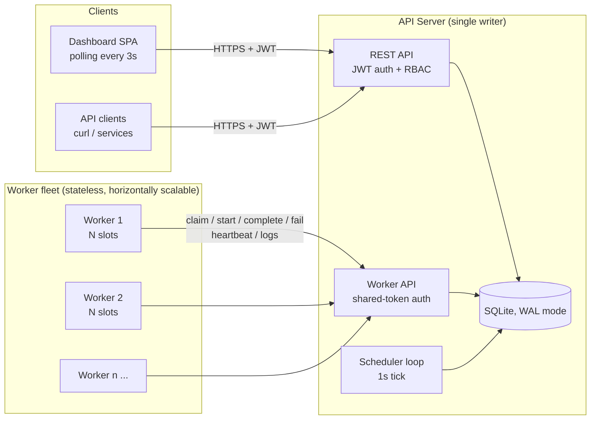
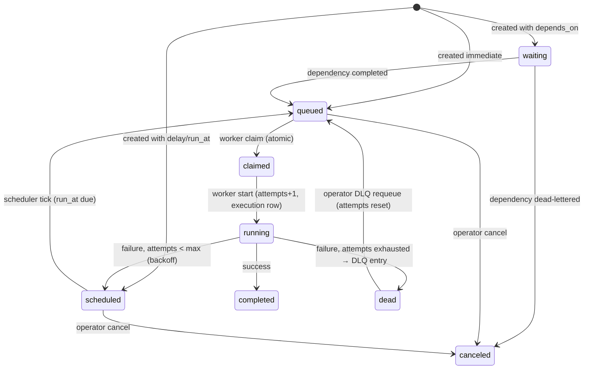

# Architecture

## System overview

Three process types:

| Component | Role | State |
|---|---|---|
| **API server** | REST API, worker API, dashboard hosting, scheduler loop | Owns the database |
| **Workers** | Claim and execute jobs, heartbeat, report results | Stateless |
| **Dashboard** | Operations UI | Browser-side only |

Workers talk to the server **only over HTTP**, never to the database. This keeps the
worker fleet stateless and trivially scalable: add a worker anywhere that can reach
the API, and it participates. All coordination (claims, concurrency limits, rate
limits) happens inside the server's single-writer transaction boundary, which is what
makes the distributed behaviour correct.

## Job lifecycle

Every attempt produces one row in `job_executions` (status, worker, duration, error,
output), so the job row is always "current state" and executions are the audit trail.

## The claim path (concurrency-critical)

`POST /api/worker/claim` runs a single transaction that:

1. Selects the best eligible job:
   - status `queued`, queue not paused, queue name in the worker's subscriptions;
   - queue's in-flight count (`claimed` + `running`) below `max_concurrency`;
   - queue's rolling-minute rate limit not exhausted;
   - ordered by queue priority ↓, job priority ↓, then FIFO age.
2. Updates it to `claimed` **guarded by `WHERE status = 'queued'`**.

better-sqlite3 executes transactions synchronously on a single connection, so claims
are fully serialized — two workers can never receive the same job. The guarded UPDATE
is kept anyway so the logic ports directly to PostgreSQL
(`SELECT … FOR UPDATE SKIP LOCKED` + the same guard) without redesign. The claim
transaction *is* the distributed lock: workers never coordinate with each other,
only through this serialized section.

## Scheduler loop

A 1-second tick inside the API server (exported as a pure function so tests can
drive time deterministically):

1. **Promote** — `scheduled` jobs with `run_at <= now` become `queued`
   (covers delayed jobs, one-off schedules, and retry backoff expiry).
2. **Materialize cron** — due rows in `scheduled_jobs` insert a concrete job and
   advance `next_run_at` from *now* (a stalled server does not fire a burst of
   catch-up runs).
3. **Reap dead workers** — workers silent past the heartbeat timeout (30s) are
   marked `offline`; their in-flight jobs get their execution closed as `lost` and
   are routed through the normal retry/DLQ decision.
4. **Release stuck claims** — a job still `claimed` past the claim timeout (60s)
   was handed to a worker that never reported start; it is returned to `queued`
   without consuming retry budget. The start transition's status guard keeps the
   original worker from running it afterwards.
5. **Prune** — heartbeat history older than the retention window is deleted.

## Reliability model

- **Delivery guarantee: at-least-once.** A worker crash after finishing work but
  before reporting causes a retry. Handlers are therefore expected to be idempotent;
  the platform supports this with idempotency keys on creation and guarded,
  replay-safe reporting endpoints.
- **No lost jobs.** Any job a dead worker held is recovered by the reaper; any retry
  wait is a `scheduled` state with a concrete `run_at`, never an in-memory timer.
- **Crash-safe state.** All state lives in the database under WAL; the server can be
  killed and restarted at any point and resumes from the tick loop.
- **Graceful shutdown.** Workers stop claiming on SIGINT/SIGTERM, finish in-flight
  jobs (up to 30s), then deregister. The server closes HTTP and the DB cleanly.

## Security model

- **Users** authenticate with short-lived JWTs; every resource access resolves the
  owning organization and enforces the caller's role (RBAC: owner > admin > member >
  viewer). Cross-org lookups return 404, not 403, to avoid leaking resource existence.
- **Workers** authenticate with a shared secret on a separate API surface
  (`/api/worker/*`) — infrastructure credentials are never mixed with user sessions.
- Passwords are bcrypt-hashed; payloads are size-limited; all input is validated
  with structured per-field errors.

## Scaling path

The current single-server design handles thousands of jobs/minute on one node. The
deliberate seams for growing past that are described in
[design decisions](design-decisions.md): swap SQLite for PostgreSQL behind the same
guarded-claim SQL, move the scheduler tick behind a leader lease, and shard queues
across servers by `queue_id` if a single writer ever saturates.
