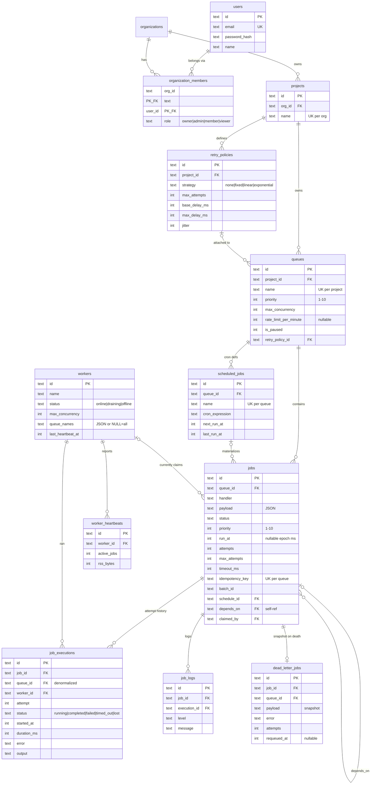

# Database Design

Full DDL with inline commentary lives in [`src/db/schema.sql`](../src/db/schema.sql).

## ER diagram

## Primary keys

Every table uses a **prefixed UUID text key** (`job_…`, `que_…`, `wrk_…`), generated
application-side. Rationale:

- IDs can be generated inside a transaction without a round-trip or sequence
  contention, and are safe to expose in URLs and logs (no enumeration).
- The prefix makes any ID self-describing in log lines and API payloads.
- `organization_members` uses a **composite PK** `(org_id, user_id)` — the natural
  key of a membership; a surrogate would add nothing and permit duplicates.

## Foreign keys & cascading

`PRAGMA foreign_keys = ON` enforces every relationship. Cascade rules follow one
principle: **children that are meaningless without their parent cascade; references
that are merely descriptive null out.**

- `organizations → projects → queues → jobs → job_executions / job_logs /
  dead_letter_jobs` are all `ON DELETE CASCADE`: deleting a project removes its
  entire job history in one statement, with no orphan sweep needed.
- `queues.retry_policy_id` is `ON DELETE SET NULL` — deleting a policy must not
  delete queues; they fall back to the default policy.
- `jobs.claimed_by`, `jobs.schedule_id`, `jobs.depends_on`,
  `job_executions.worker_id` are `SET NULL` — a deleted worker or schedule should
  not erase history, only detach it.

## Normalization

The schema is in **third normal form** with two deliberate, documented denormalizations:

1. `job_executions.queue_id` duplicates `jobs.queue_id`. Throughput metrics and the
   rolling-minute rate limiter aggregate executions *by queue and time window*
   constantly; carrying the queue id avoids a join against the (much larger) jobs
   table on every claim and every dashboard poll. It is immutable after insert, so
   there is no update anomaly.
2. `jobs.max_attempts` snapshots the retry policy at creation time. Editing a policy
   must not retroactively change jobs already in flight — the snapshot makes job
   behaviour deterministic from the moment of enqueue.
3. `dead_letter_jobs` snapshots `handler`/`payload` so a DLQ entry remains a complete,
   actionable record even if the source job row is later purged by retention jobs.

Separating `retry_policies` from `queues` (rather than inlining columns) lets one
policy be shared and tuned across many queues — a 1:N configuration relationship,
normalized as such.

## Indexes

Designed from the actual query paths, not speculatively:

| Index | Serves |
|---|---|
| `idx_jobs_claim (status, queue_id, priority DESC, created_at)` | The claim scan: eligible `queued` jobs in priority/FIFO order — the hottest query in the system |
| `idx_jobs_due (run_at) WHERE status='scheduled'` | Scheduler promotion; **partial index** stays tiny regardless of total job count |
| `idx_jobs_queue (queue_id, created_at DESC)` | Job explorer listing, newest first |
| `idx_jobs_batch / idx_jobs_worker / idx_jobs_depends` (all partial) | Batch summary, dead-worker recovery, dependency release |
| `idx_executions_job (job_id, attempt)` | Job detail attempt history |
| `idx_executions_queue (queue_id, started_at)` | Rate limiting + per-queue stats over time windows |
| `idx_schedules_due (next_run_at) WHERE is_active=1` | Cron materialization scan |
| `idx_workers_heartbeat (status, last_heartbeat_at)` | Dead-worker reaper |
| `idx_logs_job`, `idx_heartbeats_worker`, `idx_dlq_queue` | Detail views |

Unique constraints double as business rules: `users.email`,
`projects(org_id, name)`, `queues(project_id, name)`, `scheduled_jobs(queue_id,
name)`, and `jobs(queue_id, idempotency_key)` — the last one *is* the idempotent
creation mechanism (the insert conflict is impossible because creation checks first
inside the single-writer boundary; under PostgreSQL the same constraint would back
an `ON CONFLICT DO NOTHING` upsert).

## Performance considerations

- **Timestamps as epoch-millisecond integers** — scheduling is arithmetic
  (`run_at <= now`), which is index-friendly and immune to timezone/DST parsing
  costs. Formatting is a presentation concern.
- **Partial indexes** keep hot scans proportional to *active* work, not lifetime
  volume: millions of completed jobs never bloat the claim or promotion paths.
- **Status on the job row, history in executions** — the claim path touches one
  narrow row; the append-only executions table takes the write amplification.
- **WAL mode + busy timeout** — readers (dashboard polls) never block the writer;
  short writer contention waits instead of failing.
- **Retention** — heartbeat history is pruned continuously by the scheduler.
  Completed jobs/executions/logs are kept indefinitely here; a production deployment
  would add a retention sweep, which the cascade design makes a one-statement delete.
